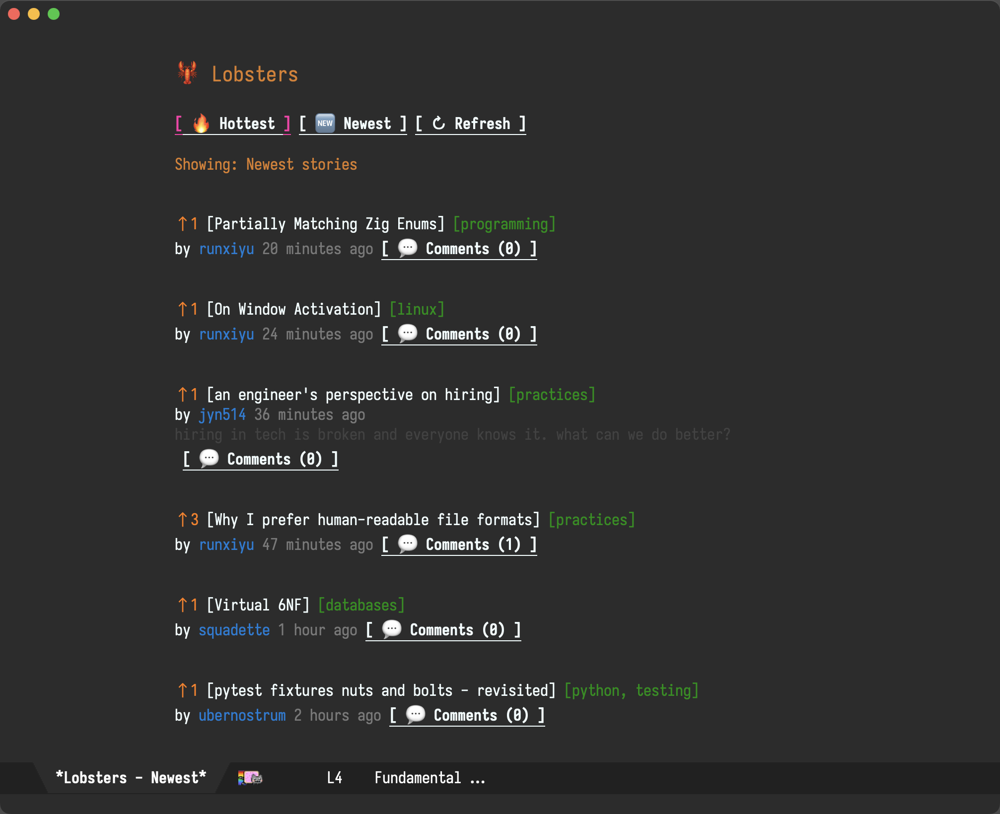

# 🦞 Lobsters.el

A simple and elegant [Lobsters](https://lobste.rs/) client for Emacs that allows you to browse the latest tech stories directly from your favorite editor.



## Features

- 🔥 **Browse hottest stories** - View the most popular stories on Lobsters
- 🆕 **Browse newest stories** - See the latest submissions
- 📖 **Clean interface** - Minimalist design focused on readability
- ⌨️ **Keyboard navigation** - Navigate stories with simple key bindings
- 🔗 **Integrated browsing** - Open links directly in eww or external browser
- 💬 **Quick access to comments** - Jump straight to story discussions
- 🏷️ **Tag display** - See story categories at a glance
- ⏰ **Relative timestamps** - Human-readable time formatting
- ↻ **Easy refresh** - Update feeds with a single keystroke

## Installation

### MELPA

In progress

### use-package

You can install directly from the repository.

Add the following to your Emacs config:

```elisp
(use-package request)
(use-package visual-fill-column)
(use-package lobsters
  :vc ( :url "https://github.com/tanrax/lobsters.el"
        :rev :newest))
```

### Manual

1. Install the `request` and `visual-fill-column` packages if you haven't already.

```
M-x package-install RET request RET
M-x package-install RET visual-fill-column RET
```

2. Clone this repository or download the files:
```bash
git clone https://github.com/tanrax/lobsters.el.git
```

3. Add to your Emacs configuration:
```elisp
(add-to-list 'load-path "/path/to/lobsters.el")
(require 'lobsters)
```

## Usage

### Basic Commands

- `M-x lobsters-hottest` - View the hottest stories from Lobsters
- `M-x lobsters-newest` - View the newest stories from Lobsters

### Keyboard Shortcuts

Once in a Lobsters buffer, use these keys:

| Key | Action |
|-----|--------|
| `n` | Go to next story |
| `p` | Go to previous story |
| `r` | Refresh current feed |
| `g` | Refresh current feed (alternative) |
| `q` | Quit and close buffer |

## Customization

### Variables

You can customize these variables:

```elisp
;; Automatic refresh interval in seconds (nil to disable)
(setq lobsters-auto-refresh-interval nil)

;; Browser function to use for opening links
(setq lobsters-browser-function 'eww)  ; Use eww (internal browser)
;; or
(setq lobsters-browser-function 'browse-url-default-browser)  ; Use system browser
```

## Advanced Configuration

```elisp
(global-set-key (kbd "C-c b h") 'lobsters-hottest)
(global-set-key (kbd "C-c b n") 'lobsters-newest)
```

## Contributing

Contributions are welcome! Please feel free to submit issues, feature requests, or pull requests.

## Changelog

### Version 1.0
- Initial release
- Hottest and newest story feeds
- Keyboard navigation
- eww integration
- Clean, minimal interface
- Tag and metadata display

*Happy browsing! 🦞*
